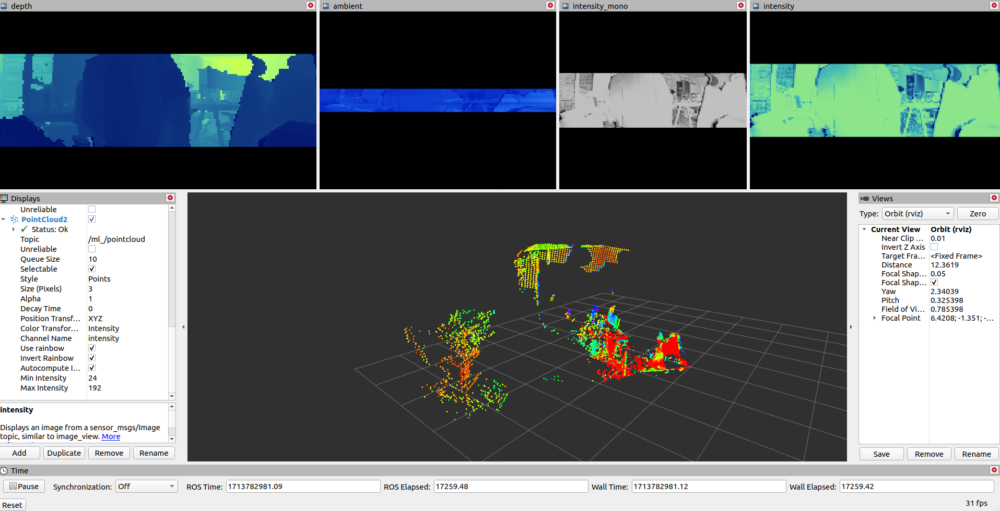

# SOSLAB ML-X LiDAR SDK
---
This is a **C++ Software Development Kit(SDK)** for connecting and using the **ML-X LiDAR developed by SOSLAB.**</br>
</br>
</br>

## Release Version
- SDK v2.3.0

# Update
- Release v2.3.0
- Remove unnecessary code
- Modify to allow changes to PC Gateway and Netmask

## Table of Contents

1. [Getting Started](#getting-started)
2. [Installation and Setup](#installation-and-setup)
3. [Using SOS Studio](#using-sos-studio)
4. [Documentation](#documentation)

## Getting Started

To get started with this project, you will need:

- C++ development environment
- Windows or Ubuntu operating system
- SOSLAB ML-X LiDAR device

## Installation and Setup

Clone this repository to your local machine to access the APIs, examples, and other resources.

### Windows

APIs and examples for Windows can be found in the `MLX_API/examples/test_ml` folder.

### Ubuntu/ROS

APIs and examples for Ubuntu/ROS can be found in the `MLX_API/examples/ros_ml` folder.

### Firmware

To be updated.

## Using SOS Studio

SOS Studio is a LiDAR visualization software that runs on both Windows and Linux operating systems. <br/>
The Linux version supports Ubuntu 18.04, 20.04, and 22.04.

### Windows Installation

To install and use SOS Studio on Windows, follow these steps:

1. Navigate to the `SOS_Studio/Windows` folder.
2. Run the `SOS Studio_setup.exe` executable file.

### Linux Installation

To install and use SOS Studio on Linux, follow these steps:

1. Open the terminal and navigate to the 'SOS_Studio/Linux' folder.
2. Install the required dependencies by running the following command:

```shell
sudo apt-get install '^libxcb.*-dev'
```

3. Make the sos_studio.sh file executable by running the following command:
```shell
chmod a+x ./sos_studio.sh
chmod a+x ./deployqt/bin/sos_studio
```

4. Execute the sos_studio.sh script to run SOS Studio:
```shell
./sos_studio.sh
```


## Documentation

User guides can be found in the `User_Guide` folder:

- [User Guide (English)](User_Guide/ML-X_User_Guide_v2.3.0(EN).pdf)
- [User Guide (Korean)](User_Guide/ML-X_User_Guide_v2.3.0(KOR).pdf)


## License

SOS Studio S/W uses the Qt library, which is licensed under the GNU Lesser General Public License (LGPL) version 3. <br/>
We have complied with the requirements of the LGPL by dynamically linking to the Qt library. <br/>
This means that users have the ability to replace the Qt library with their own version if they wish. <br/>

The source code of the Qt library can be found here: <br/>
[https://download.qt.io/official_releases/qt/](https://download.qt.io/official_releases/qt/)

For more information about the LGPL, please refer to the full text of the license, available here: <br/>
[https://www.gnu.org/licenses/lgpl-3.0.html](https://www.gnu.org/licenses/lgpl-3.0.html)
